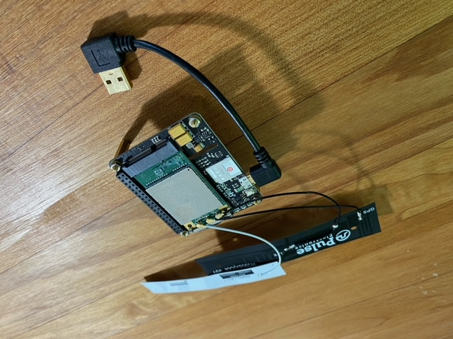

# IOT-WeeklyScheduler
Weekly Scheduler for IOT remote device using Node.Red and associated 3rd party nodes

- [Concept](#concept)
- [Dependancies](#dependancies)
- [Installation](#installation)
- [UI Workflow](#ui-workflow)
  - [UI Demo](#ui-demo)
  - [UI Images](#ui-images)
  - [UI Functions](#ui-functions)
- [Hardware](#hardware)
  - [Hardware Images](#hardware-images)
- [Future Development](#future-development)
- [Key Contributors](#key-contributors)

---

## Concept

A farmer required a way to remotely schedule when their water pump would turn on and off. Including the following:
  1. Accessed via mobile device 
  2. Schedule for any given day of the week
  3. Have the ability to turn on and off twice in the one day
  4. BONUS: Ability to table the current levels of the surrounding lakes and reservoirs

## Dependancies

This repository makes use of the following:

- The platform [Node.RED](https://nodered.org/)
- Critical nodes such as [Schedex](https://github.com/biddster/node-red-contrib-schedex)
- [Raspberry Pi](https://www.raspberrypi.org/) using a [Sixfab Raspberry Pi 3G/4G & LTE Base HAT](https://sixfab.com/) with Quectel EC25 Mini PCIe 4G/LTE Module and [Super SIM card](https://www.twilio.com/) from Twilio
- Wireframes and/or mockups for a potential dApp UI

### Installation

1. Install Node.RED
2. Download `flow.json`
3. Start node.RED
4. Import  `flow.json` into your node.RED session
5. Hit deploy and enjoy!

## UI Workflow

#### UI Demo


#### UI Images

**Overall Node Configuration for Weekly Scheduler and Pump Status**


**Pump Status**


**Daily nodes**


**News-Node**


### UI Functions

```js
//recieve set hour and minutes as they arrive under the specific "topic"
var hrs = msg.payload["pump/schedule/mon/1/on/hours"];
var mins = msg.payload["pump/schedule/mon/1/on/mins"];
var time = context.get('time') || 0;

var d = new Date();
var day = d.getDay();
time = hrs + ":" + mins;
//if reset is triggered then check if it is on and still the same day. If so reset values and turn it off
if(time === ":" && day === 1) {
    msg.payload = "off";
    return msg;
   }else if(time === ":" && day !== 1) {
        msg.payload.suspended = true;
        return msg;
    }else {
        msg.payload.suspended = false;
        msg.payload.ontime = time;
        return msg;
    } 
```


## Hardware

### Hardware Images

**Complete System**


**Hardware Case**


**4G Base HAT**



**Relays and CPU Fan**


**Raspberry Pi**


## Future Development

Looking to expand this IOT device to take various inputs such as water pressure and the farm dam level for automatic operation such as shutdown when level reached 

## Key Contributors

- [Simon Palmer - @simondpalmer](https://github.com/simondpalmer)
